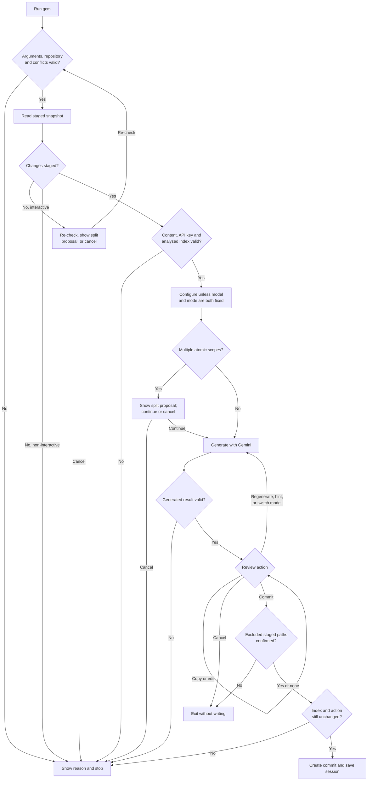
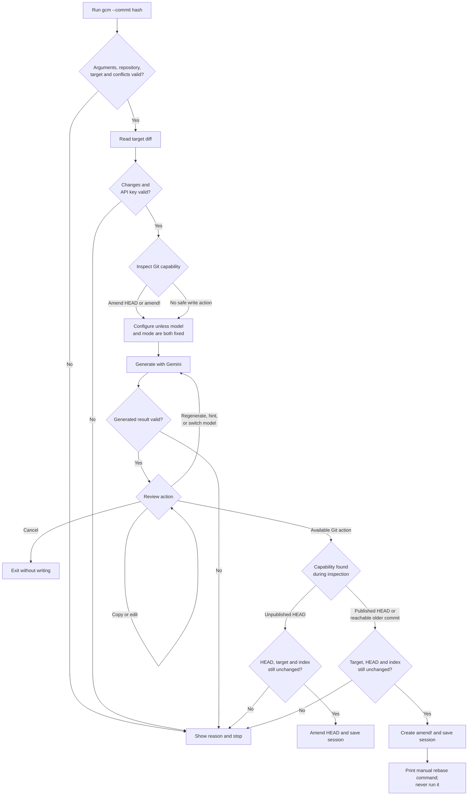

# User flows

`gcm` has two generation use cases. Flags such as `--model`, `--mode`,
`--exclude`, `--verbose` and `--debug` modify these flows; they do not create
separate ones.

## Staged changes: `gcm`

## Existing commit: `gcm --commit <hash>`

The exact write-action matrix and edge cases remain in the
[Commit Safety](../README.md#commit-safety) table.
