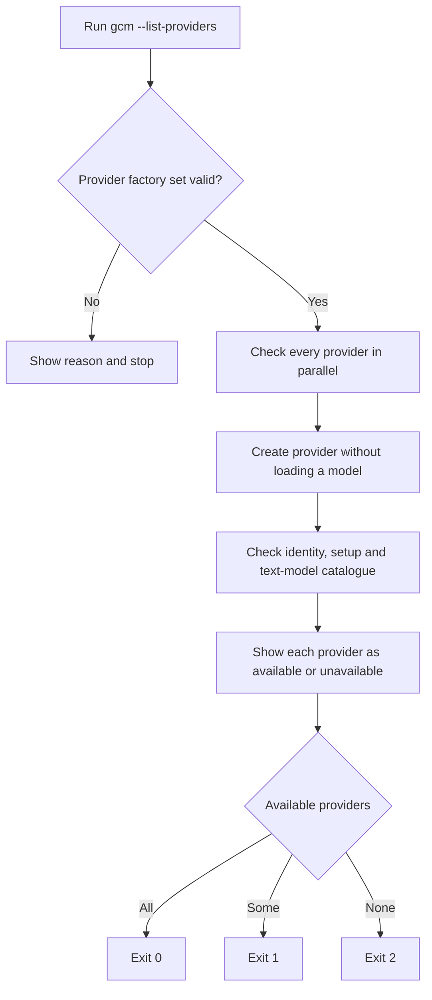
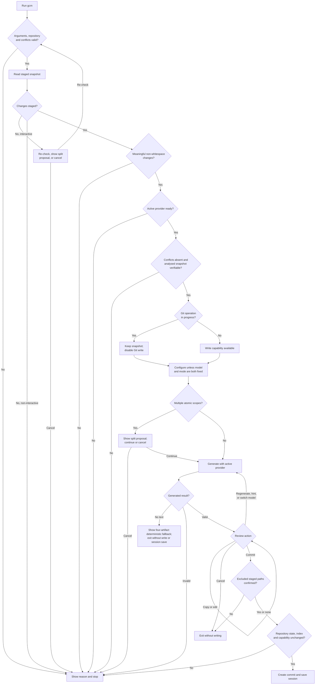
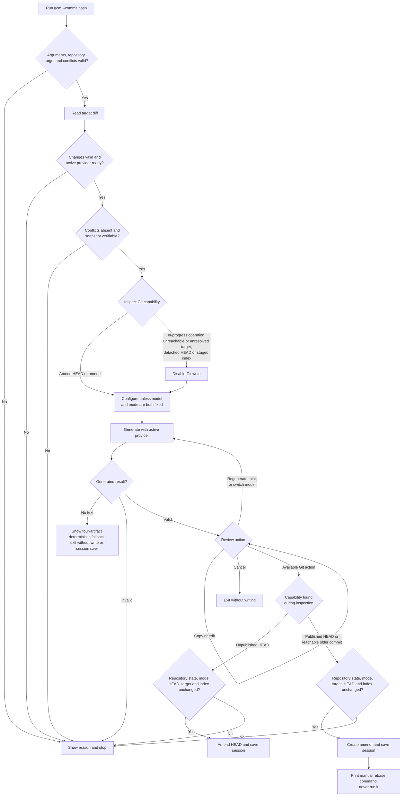
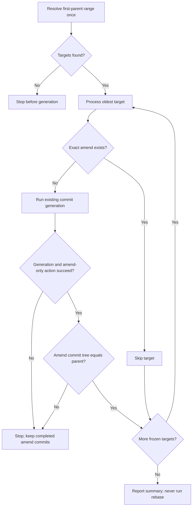

# User flows

`gcm` has three generation use cases. Flags such as `--provider`, `--model`, `--hint`, `--mode`,
`--exclude`, `--verbose` and `--debug` modify these flows; they do not create
separate ones.

`--non-interactive` skips configuration, atomicity, and review prompts. It
stops after generation unless explicit `--apply` requests the available Git
action.

## Provider check: `gcm --list-providers`

The command ignores the selected provider because it checks all providers. It
does not read Git state, generate text, load an LM Studio model or save a session.

## Staged changes: `gcm`

## Existing commit: `gcm --commit <hash>`

The exact write-action matrix and edge cases remain in the
[Commit Safety](../README.md#commit-safety) table.

Immediately before a selected write, the action service re-reads repository
state, conflicts, the index snapshot and capability. Target actions also
revalidate HEAD and the resolved target. The delegated Git write boundary then
checks the index and HEAD/target once more. Session model and mode are saved
only after that Git action succeeds.

## Commit range: `gcm --commit-range <range>`

The range is sequential, non-interactive and first-parent only. Existing
`amend!`, `fixup!` and `squash!` commits are excluded from its frozen targets.
Unexpected HEAD movement, index changes, Git operations and hook-added file
changes stop the batch without rollback. Re-running skips exact existing
`amend! <full-hash>` commits.
